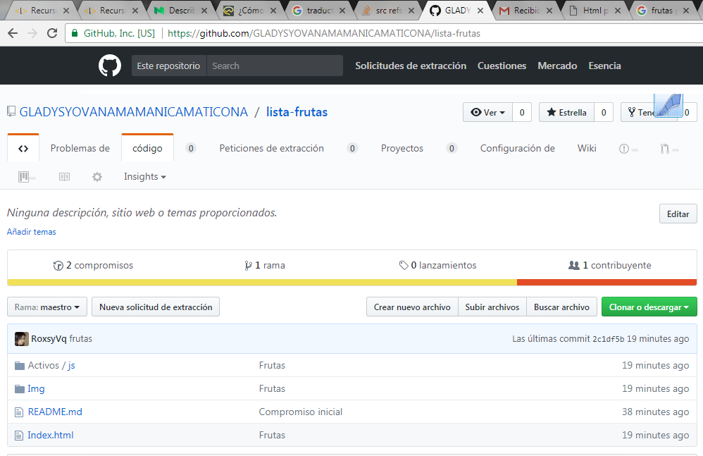
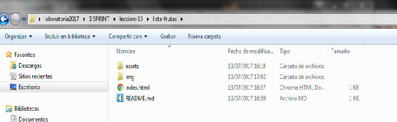

#Markdown
## Crear repositorio en github
### Para crear un repositorio primero debes ir  la opción + "New repository Import repository New gist New organization", poner el nombre de tu repositorio y luego crear.

## Crear carpeta local (leccion-13)
###Dentro de la carpeta crear una subcarpeta y nombrarla (assets) dentro de esta sub carpeta otra nombrada (js). 

##Implementar el archivo (JS) y (HTML)
**Archivo Javascript**
### Con el código en javascript se logra ingresar mas frutas, haciendo un click en el boton (añadir nueva compra) y  mostrar la lista de frutas, haciendo click en el boton (mostrar toda mis compras). 

### El resultado es como se muestra en la imagen siguiente. 
**Archivo html**
###Para lograr la presentación de la imagen anterior  el archivo js enlasado al archivo html (index.html)

##Clonar mi repositorio (lista-frutas) en local.

##comitear de local a mi repositorio remoto (github).

